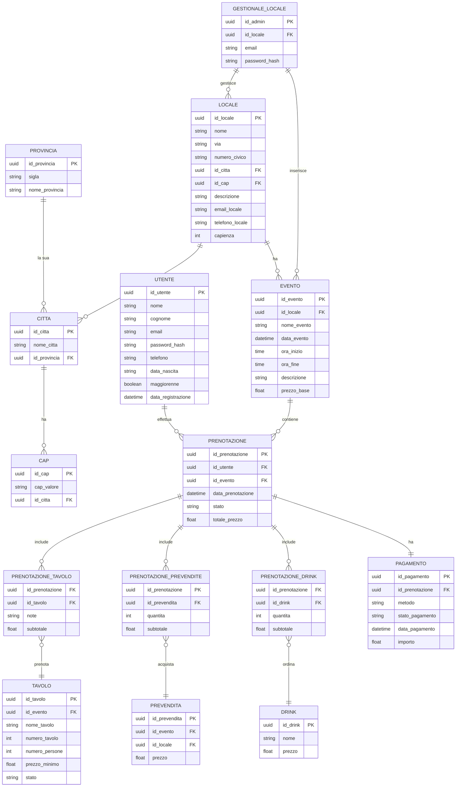

```mermaid
erDiagram

    UTENTE {
        uuid id_utente PK
        string nome
        string cognome
        string email
        string password_hash
        string telefono
        string data_nascita
        boolean maggiorenne
        datetime data_registrazione
    }

    LOCALE {
        uuid id_locale PK
        string nome
        string via
        string numero_civico
        uuid id_citta FK
        uuid id_cap FK
        string descrizione
        string email_locale
        string telefono_locale
        int capienza
    }

    PROVINCIA {
        uuid id_provincia PK
        string sigla
        string nome_provincia
    }

    CITTA {
        uuid id_citta PK
        string nome_citta
        uuid id_provincia FK
    }

    CAP {
        uuid id_cap PK
        string cap_valore
        uuid id_citta FK
    }

    EVENTO {
        uuid id_evento PK
        uuid id_locale FK
        string nome_evento
        datetime data_evento
        time ora_inizio
        time ora_fine
        string descrizione
        float prezzo_base
    }

    TAVOLO {
        uuid id_tavolo PK
        uuid id_evento FK
        string nome_tavolo
        int numero_tavolo
        int numero_persone
        float prezzo_minimo
        string stato
    }

    DRINK {
        uuid id_drink PK
        string nome
        float prezzo
    }

    PRENOTAZIONE {
        uuid id_prenotazione PK
        uuid id_utente FK
        uuid id_evento FK
        datetime data_prenotazione
        string stato
        float totale_prezzo
    }

    PREVENDITA {
        uuid id_prevendita PK
        uuid id_evento FK
        uuid id_locale FK
        float prezzo

    }

    PRENOTAZIONE_PREVENDITE {
        uuid id_prenotazione PK
        uuid id_prevendita FK
        int quantita
        float subtotale
    }

    PRENOTAZIONE_TAVOLO {
        uuid id_prenotazione FK
        uuid id_tavolo FK
        string note
        float subtotale
    }

    PRENOTAZIONE_DRINK {
        uuid id_prenotazione FK
        uuid id_drink FK
        int quantita
        float subtotale
    }

    PAGAMENTO {
        uuid id_pagamento PK
        uuid id_prenotazione FK
        string metodo
        string stato_pagamento
        datetime data_pagamento
        float importo
    }

    GESTIONALE_LOCALE {
        uuid id_admin PK
        uuid id_locale FK
        string email
        string password_hash
    }

    LOCALE ||--o{ EVENTO : ha
    PROVINCIA ||--o{ CITTA : "la sua"
    CITTA ||--o{ CAP : ha
    LOCALE ||--o{ CITTA : "dentro la"
    UTENTE ||--o{ PRENOTAZIONE : effettua
    EVENTO ||--o{ PRENOTAZIONE : contiene
    PRENOTAZIONE ||--|| PAGAMENTO : ha
    PRENOTAZIONE ||--o{ PRENOTAZIONE_TAVOLO : include
    PRENOTAZIONE ||--o{ PRENOTAZIONE_PREVENDITE : include
    PRENOTAZIONE ||--o{ PRENOTAZIONE_DRINK : include
    PRENOTAZIONE_TAVOLO }o--|| TAVOLO : prenota
    PRENOTAZIONE_DRINK }o--|| DRINK : ordina
    PRENOTAZIONE_PREVENDITE }o--|| PREVENDITA : acquista
    GESTIONALE_LOCALE ||--o{ EVENTO : inserisce
    GESTIONALE_LOCALE ||--o{ LOCALE : gestisce
```